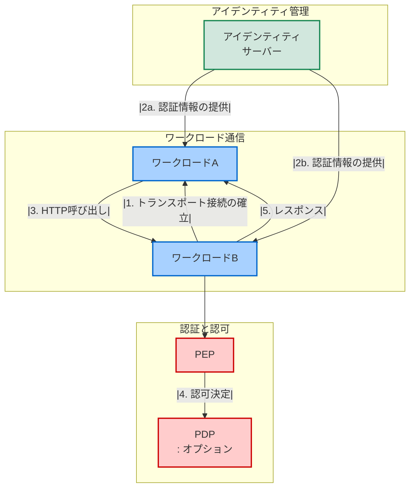

# WIMSE アーキテクチャ図

## デプロイメントアーキテクチャと通信フロー

以下のmermaid図は、WIMSEのデプロイメントアーキテクチャと通信フローを示しています。

## 通信フローの説明

1. **トランスポート接続の確立**:
   - 相互TLSの場合: この段階で両方のワークロードが互いに認証されます
   - アプリケーションレベルのセキュリティの場合: TLS接続は通常一方向の認証で、ワークロードレベルの認証はまだ行われません

2. **認証情報の取得**:
   - ワークロードA（およびワークロードB）はアイデンティティサーバーから認証情報を取得します
   - これは定期的に行われます（例：24時間ごと）

3. **HTTP呼び出し**:
   - ワークロードAはワークロードBにHTTP呼び出しを行います
   - これは通常のHTTPリクエストに、追加の保護メカニズムを加えたものです

4. **認証と認可**:
   - アプリケーションレベルのセキュリティの場合: ワークロードBはワークロードAを認証します（相互TLSの場合、これはステップ1で行われています）
   - いずれの場合も、ワークロードBは呼び出しを許可するかどうかを決定します
   - 特定のアーキテクチャでは、ワークロードBはこの決定を行う際に外部サーバー（PDP）に相談する必要がある場合があります

5. **レスポンスの返却**:
   - ワークロードBはワークロードAにレスポンスを返します
   - これはエラーレスポンスまたは通常のレスポンスのいずれかです
