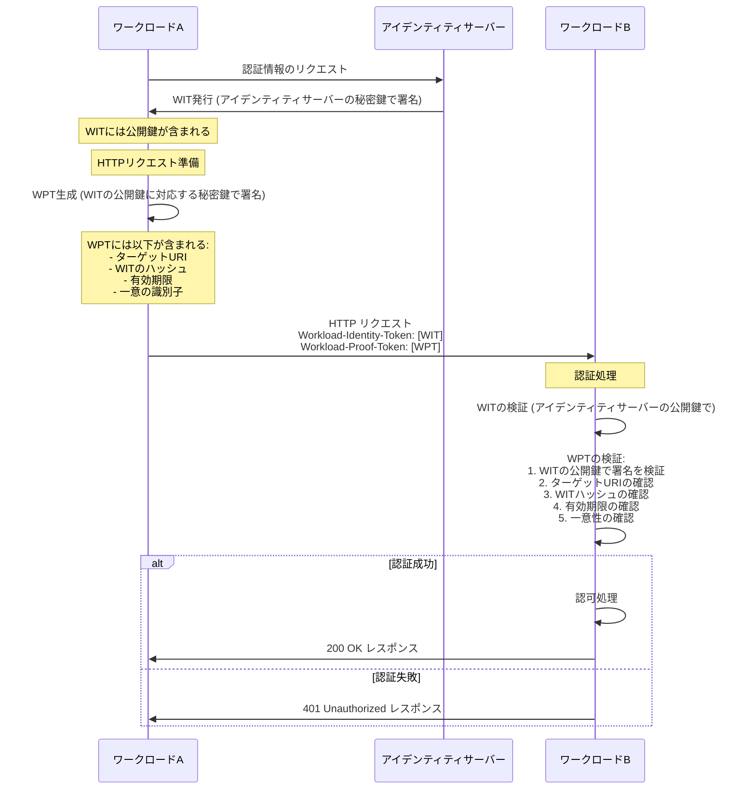
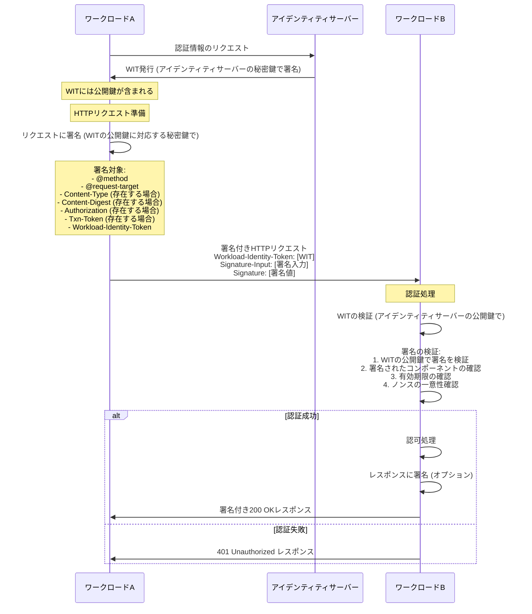
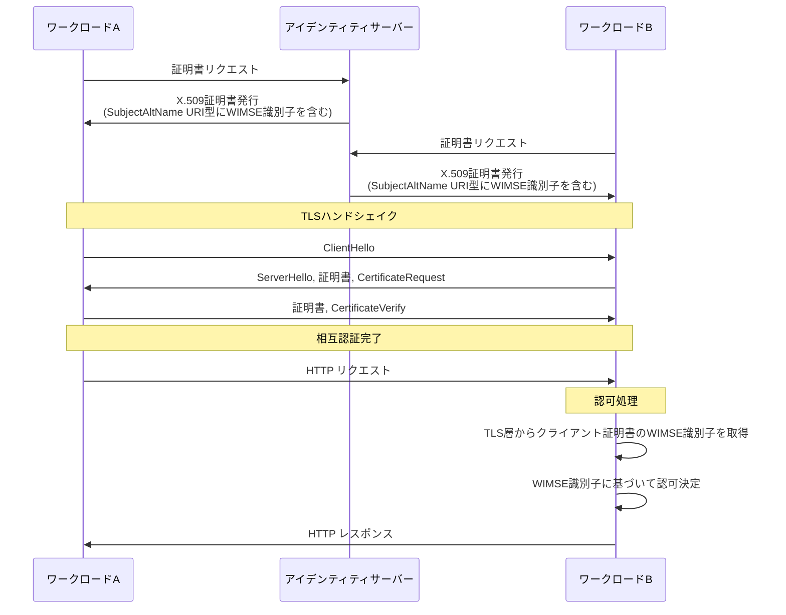

# WIMSE メッセージフロー図

## アプリケーションレベル認証のメッセージフロー

以下のmermaid図は、アプリケーションレベル認証のメッセージフローを示しています。

### DPoP方式のメッセージフロー

### HTTP Message Signatures方式のメッセージフロー

## 相互TLS（mTLS）認証のメッセージフロー

以下のmermaid図は、相互TLS認証のメッセージフローを示しています。

## 認証オプションの比較

以下の表は、WIMSEで提供される3つの認証オプションの主な特徴を比較しています：

| 特徴 | DPoP方式 | HTTP Message Signatures方式 | 相互TLS (mTLS) |
|------|---------|------------------------|--------------|
| **認証レベル** | アプリケーション | アプリケーション | トランスポート |
| **トークン形式** | JWT | HTTP署名 | X.509証明書 |
| **ミドルボックス対応** | ✅ | ✅ | ❌ |
| **レスポンス署名** | ❌ | ✅ | ✅ (TLSレベル) |
| **実装の複雑さ** | 中 | 高 | 低 |
| **HTTP以外のプロトコル適応性** | 高 | 低 | 高 |
| **既存インフラ活用** | JWT | HTTP署名 | PKI |
| **メッセージ整合性保護** | 部分的 | 高 | 高 |
