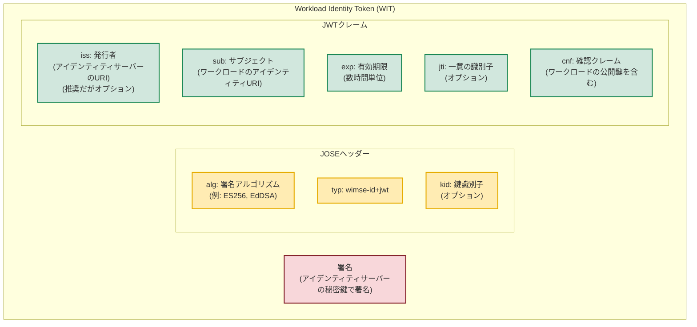
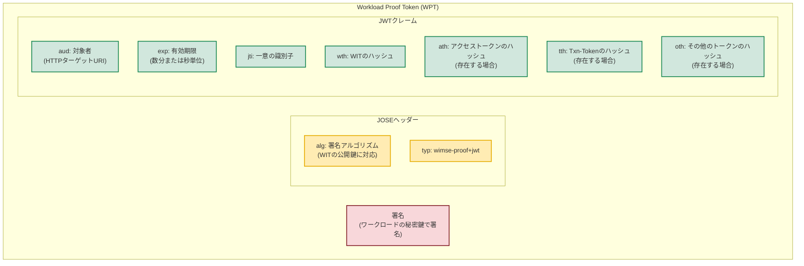
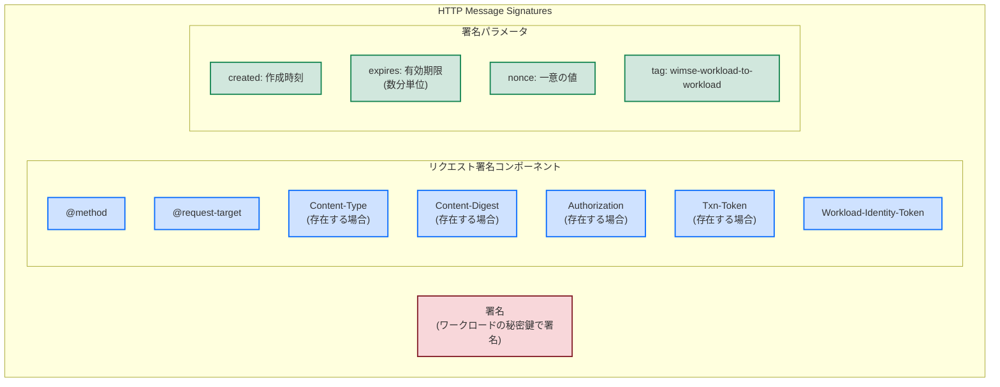

# WIMSE トークン構造図

## Workload Identity Token (WIT) 構造

以下のmermaid図は、Workload Identity Token (WIT) の構造を示しています。



## DPoP方式: Workload Proof Token (WPT) 構造

以下のmermaid図は、DPoP方式で使用されるWorkload Proof Token (WPT) の構造を示しています。



## HTTP Message Signatures方式

以下のmermaid図は、HTTP Message Signatures方式で署名されるコンポーネントを示しています。



## 認証フロー比較

以下のmermaid図は、2つの認証オプションのフローを比較しています。

```mermaid
sequenceDiagram
    participant A as ワークロードA
    participant IS as アイデンティティサーバー
    participant B as ワークロードB
    
    rect rgb(240, 240, 255)
    note right of A: 共通ステップ
    A->>IS: 認証情報のリクエスト
    IS->>A: WIT発行
    end
    
    rect rgb(255, 240, 240)
    note right of A: DPoP方式
    A->>A: WPT生成 (WITの公開鍵に対応する秘密鍵で署名)
    A->>B: HTTP リクエスト + WIT + WPT
    B->>B: WITの検証
    B->>B: WPTの検証
    B->>A: レスポンス
    end
    
    rect rgb(240, 255, 240)
    note right of A: HTTP Message Signatures方式
    A->>A: リクエストに署名 (WITの公開鍵に対応する秘密鍵で)
    A->>B: 署名付きHTTPリクエスト + WIT
    B->>B: WITの検証
    B->>B: 署名の検証
    B->>B: レスポンスに署名 (オプション)
    B->>A: 署名付きレスポンス
    end
